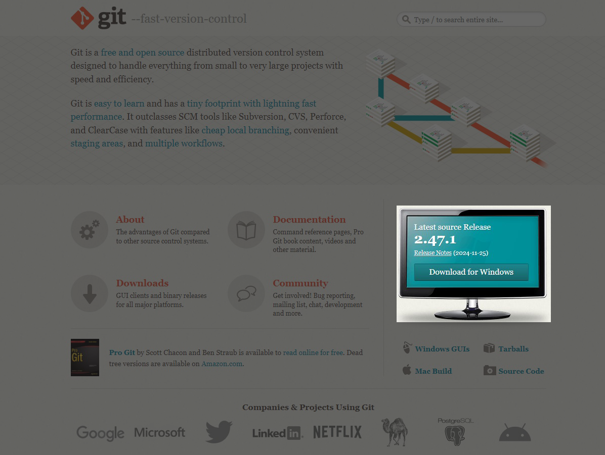
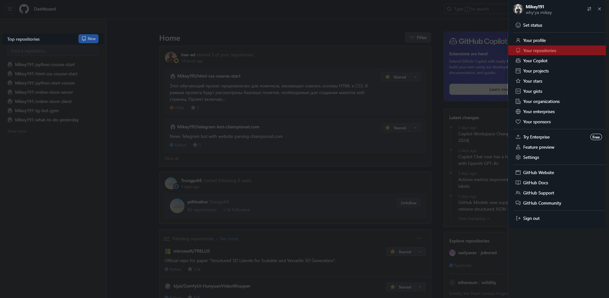
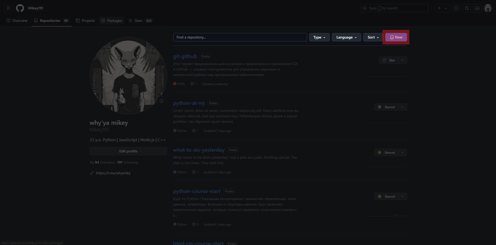
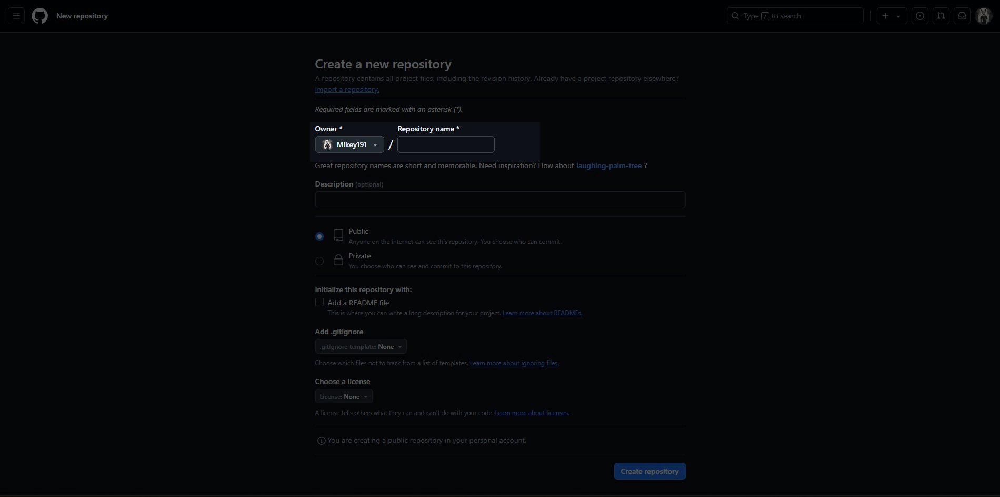
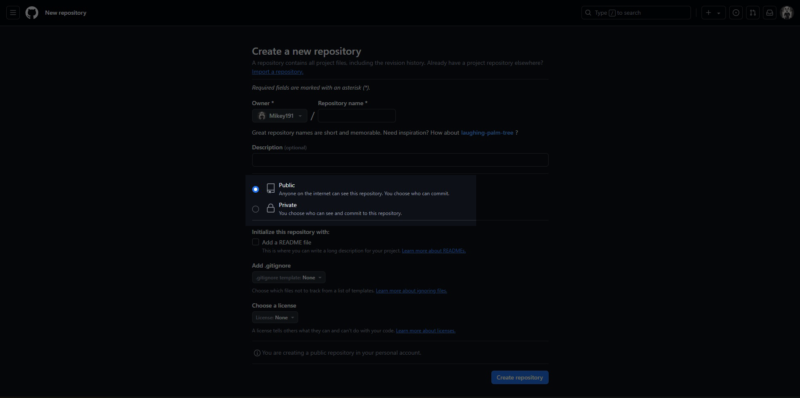
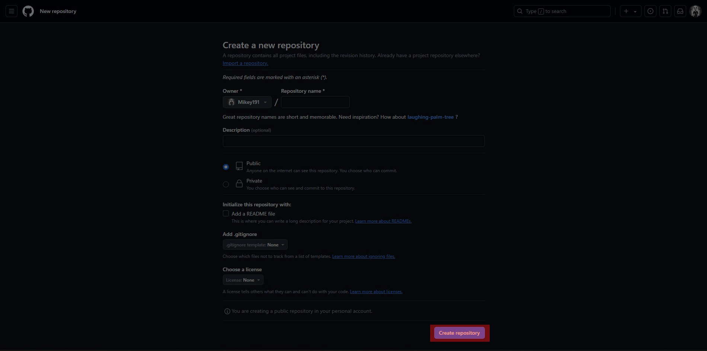
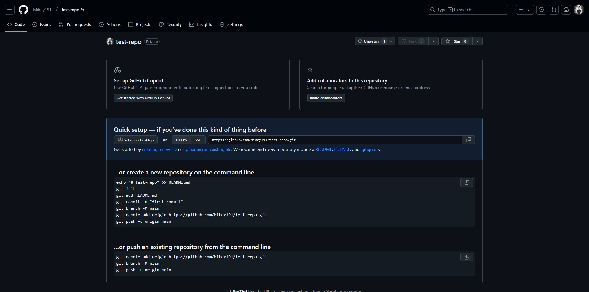

# Git & GitHub

## 1. Git и GitHub.

### 1.1 Что такое Git?

`Git` — **это распределенная система контроля версий вашего проекта**, которая позволяет **отслеживать изменения в файлах** и **управлять историей этих изменений**. Она была разработана для **поддержки совместной работы программистов над проектами**, **обеспечивая возможность вести параллельную разработку** и **интеграцию изменений от разных участников**.

- **`Git` позволяет разработчикам**:

  - **Отслеживать изменения в коде и других файлах**, что упрощает управление проектами.
  - **Создавать ветки для разработки новых функций или исправления ошибок**, не влияя на основную версию проекта.
  - **Объединять изменения из разных веток**, что позволяет легко интегрировать работу нескольких разработчиков.

- **Почему `Git` важен?**. `Git` стал **стандартом в индустрии разработки программного обеспечения по нескольким причинам**:
  - **Скорость и эффективность**: `Git` **оптимизирован для быстрого выполнения операций, таких как коммиты и слияния, что делает его удобным для работы над большими проектами**.
  - **Поддержка распределенной работы**: **Каждый разработчик имеет полную копию репозитория на своем компьютере, что позволяет работать офлайн и синхронизировать изменения позже**.
  - **Безопасность и целостность данных**: `Git` **использует механизмы, которые обеспечивают целостность данных, что минимизирует риск потери информации**.
  - **Широкое сообщество и поддержка**: `Git` **активно используется тысячами разработчиков по всему миру**, что обеспечивает **наличие большого количества ресурсов, документации и инструментов для обучения**.

### 1.2 Что такое GitHub?

`GitHub` — это **веб-сервис, который предоставляет платформу для хостинга и управления проектами, использующими систему контроля версий `Git`**. Он стал **одним из самых популярных инструментов для разработчиков по всему миру**, **позволяя им эффективно работать над проектами как индивидуально, так и в команде**.

#### **Основные функции `GitHub`**:

- **Хостинг репозиториев**: `GitHub` **позволяет пользователям создавать и хранить репозитории, которые содержат код и другие файлы проекта**. **Каждый репозиторий может быть `публичным` или `приватным`, что дает возможность контролировать доступ к проекту**.
- **Совместная работа**: `GitHub` **предоставляет инструменты для совместной работы, такие как возможность создания веток, слияния изменений и управления конфликтами**. Это **позволяет нескольким разработчикам работать над одним проектом одновременно, не мешая друг другу**.
- **Отслеживание изменений**: `GitHub` **хранит историю всех изменений, внесенных в проект**. Это позволяет **разработчикам видеть, кто и когда вносил изменения, а также возвращаться к предыдущим версиям файлов при необходимости**.
- **Управление задачами**: `GitHub` включает в себя **инструменты для управления задачами и отслеживания проблем (`issues`)**, что помогает командам **организовывать свою работу и следить за прогрессом**.
- **Документация**: `GitHub` позволяет **создавать и хранить документацию проекта прямо в репозитории, что упрощает доступ к информации о проекте для других разработчиков и пользователей**.

#### **Функция `GitHub Pages`**:

**Одной из уникальных функций `GitHub` является `GitHub Pages`** — **бесплатный хостинг для статических сайтов**. Это **позволяет разработчикам размещать свои проекты в интернете, чтобы продемонстрировать их другим**. Например, **разработчики сайтов могут загружать свои HTML, CSS и JavaScript файлы на GitHub и использовать GitHub Pages для создания веб-сайтов, которые могут быть доступны по URL-адресу**.
**Это особенно полезно для `создания портфолио`, `демонстрации проектов` или `проведения учебных экспериментов`**. `GitHub Pages` **поддерживает пользовательские домены и предоставляет возможность настраивать внешний вид сайта с помощью различных тем**.

#### **Почему GitHub важен для разработчиков?**

- **Портфолио**: GitHub позволяет разработчикам создавать публичные репозитории, которые могут служить портфолио их работы. Это особенно важно для фрилансеров и тех, кто ищет работу, так как потенциальные работодатели могут легко просмотреть их проекты и код.
- **Сообщество**: GitHub объединяет миллионы разработчиков, что создает возможности для обмена знаниями и сотрудничества. Разработчики могут участвовать в проектах других людей, вносить свои изменения и предлагать улучшения.
- **Интеграция с другими инструментами**: GitHub интегрируется с множеством других инструментов и сервисов, таких как CI/CD (непрерывная интеграция и непрерывная доставка), что упрощает процесс разработки и развертывания приложений.
- **Обучение и ресурсы**: GitHub предоставляет доступ к множеству открытых проектов и ресурсов, что позволяет разработчикам учиться на примерах и улучшать свои навыки.

## 2. Начало работы с `Git` и `GitHub`.

### 2.1 **Скачивание Git**

Для начала работы с `Git`, его необходимо скачать. Перейдите на [официальный сайт Git](https://git-scm.com/downloads) и **выберите версию для `Windows`**. Скачайте установочный файл.



### 2.2 **Установка Git**

- **После скачивания установочного файла выполните следующие шаги**:
  - **Запустите установщик**.
  - **Следуйте инструкциям на экране, выбирая параметры по умолчанию, если вы не уверены в своих предпочтениях**.
  - **Завершите установку**.

После установки **проверьте, что Git установлен правильно**, выполнив команду в командной строке:

```bash
git --version
```

Эта команда выведет установленную версию `Git`.

### 2.3 **Создаем учетную запись GitHub**

Перейдите на [GitHub](https://github.com/) и нажмите на кнопку `"Sign up"`. Заполните необходимые **поля для создания учетной записи**. **После регистрации вам будет предложено подтвердить адрес электронной почты**.

### 2.4 **Создать проект на компьютере**

**Создайте новую папку на вашем компьютере для проекта**. Например, **создайте папку `MyWebsite` на рабочем столе**. В этой папке **создайте файлы `index.html` и `style.css`, которые будут основными файлами вашего сайта**.

## 4 Работа с командами Git для индивидуального проекта.

### 4.1 **Открыть проект в VSCode и создать репозиторий**.

- **Откройте Visual Studio Code**
- **Откройте проект**: выберите `"File" (Файл)` > `"Open Folder" (Открыть папку)` и выберите **папку вашего проекта**.
- **Запустите терминал в VSCode**: Для открытия встроенного терминала в VSCode, нажмите сочетание клавиш Ctrl + \` или выберите `"Terminal" (Терминал)` в верхнем меню и затем `"New Terminal" (Новый терминал)`.
- **Проверьте, что `Git` установлен**: В терминале введите команду: `git --version`

### 4.2 **Создать в проекте git зависимость. Репозиторий `git`**

**Репозиторий `Git`** — это **основная структура данных в системе контроля версий `Git`**, которая **хранит все изменения, внесенные в проект, начиная с момента его инициализации**. **Репозиторий может содержать как файлы проекта, так и всю историю изменений этих файлов, что позволяет разработчикам отслеживать, управлять и восстанавливать различные версии кода**.

- **Инициализируйте новый Git-репозиторий**: В терминале введите команду: `git init`
- Эта команда создаст скрытую папку `.git`, которая будет содержать все данные о версиях вашего проекта.

### 4.3 **Добавление всех файлов в индекс Git**

**Перед добавлением файлов в индекс полезно проверить их статус. Для этого используется команда**: В терминале введите команду: `git status`. Эта команда выводит информацию о текущем состоянии репозитория, включая:

- **Измененные файлы**, которые еще не добавлены в индекс (не закоммичены).
- **Файлы, готовые к коммиту**, которые уже добавлены в индекс.
- **Неотслеживаемые файлы**, которые не находятся под контролем Git.
- **Статус файлов помогает понять**, какие изменения были внесены и какие действия необходимо предпринять.

**Добавление всех файлов в индекс Git**. Чтобы добавить все изменения в рабочей директории в индекс, используется команда: В терминале введите команду: `git add .`. **Эта команда добавляет все измененные и новые файлы в индекс, подготавливая их к следующему коммиту**. Это удобно, когда вы хотите зафиксировать все изменения сразу, не выбирая файлы по отдельности.

Если вам нужно добавить только один конкретный файл в индекс, вы можете использовать команду: В терминале введите команду: `git add имя_файла`. Например, если вы хотите добавить файл index.html, выполните: `git add index.html`.

### 4.4 **Добавление коммита для файлов в индексе**

**Коммит в `Git`** — это **команда, которая фиксирует изменения в репозитории**. **Каждый коммит представляет собой снимок состояния файлов на момент его создания и включает в себя метаданные, такие как автор, дата и сообщение коммита**. Коммиты позволяют **отслеживать историю изменений в проекте**, что делает возможным возврат к предыдущим версиям файлов при необходимости. **Коммит можно рассматривать как точку сохранения, которая фиксирует текущее состояние проекта**.

- **Создайте коммит**: **Используйте команду `git commit` для создания коммита**. Вы можете добавить сообщение коммита с помощью флага `-m`. Например: `git commit -m "Добавлены новые стили для страницы"`.
- **Проверка коммита**: После выполнения команды `git commit` вы можете проверить историю коммитов с помощью команды: `git log` .

### 4.5 **Связывем репозиторий на компьютере с новым репозиторием на сайте `GitHub`**

1. **Зайти на лицевую страницу вашего аккаунта GitHub**
   - Откройте веб-браузер и перейдите на сайт [GitHub](https://github.com/).
   - Войдите в свой аккаунт, используя свои учетные данные (логин и пароль).
2. **Перейти во вкладку Репозитории**
   - На главной странице вашего аккаунта вы увидите панель навигации в верхней части экрана.
   - Нажмите на вкладку `"Repositories"` (Репозитории), чтобы увидеть список всех ваших репозиториев.
   - 
3. **Нажать на кнопку Новый репозиторий**
   - В правом верхнем углу страницы репозиториев вы найдете кнопку `"New"` (Новый репозиторий). Нажмите на нее, чтобы начать процесс создания нового репозитория.
   - 
4. **Придумать имя для вашего проекта**
   - На странице создания нового репозитория вам будет предложено ввести имя для вашего проекта. **Это имя будет отображаться на сайте `GitHub` и должно быть уникальным в рамках вашего аккаунта**. Выберите имя, которое отражает суть вашего проекта, например, `my-awesome-project`.
   - 
5. **Выбрать статус вашего репозитория**
   - `Public` (Открытый): **любой пользователь GitHub сможет видеть ваш репозиторий и его содержимое**.
   - `Private` (Закрытый): **только вы и те, кому вы предоставите доступ, сможете видеть репозиторий**.
   - 
6. **Создание репозитория**
   - После того как вы ввели имя и выбрали статус, нажмите на кнопку `"Create repository"` (Создать репозиторий) внизу страницы.
   - 

### 4.6 **Связать проект на компьютере с проектом на GitHub**

**При создании репозитория на `GitHub` вам будет предложено два варианта для связывания удаленного репозитория с локальным**. **Давайте подробно рассмотрим, что происходит в каждом из этих вариантов**.



- **Первый вариант**. Этот вариант подходит для тех, кто начинает новый проект и хочет сразу создать файл `README` и сделать первый коммит.

  - **Создание файла `README.md`**: Команда `echo "# test-repo" >> README.md` **создает файл** `README.md` и **добавляет в него заголовок**. Этот файл часто используется для описания проекта.
  - **Инициализация нового репозитория**: `git init` **инициализирует новый локальный репозиторий в текущей директории**. Это **создает скрытую папку `.git`, где Git будет хранить всю информацию о версиях**.
  - **Добавление файла в индекс**: `git add README.md` **добавляет файл `README.md` в индекс, подготавливая его к коммиту**.
  - **Создание первого коммита**: `git commit -m "first commit"` **создает первый коммит с сообщением `"first commit"`**. Это фиксирует текущее состояние файлов в репозитории.
  - **Переименование основной ветки**: `git branch -M main` **переименовывает текущую ветку в `main`**. Это важно, так как **GitHub по умолчанию использует `main` как основную ветку**.
  - **Добавление удаленного репозитория**: `git remote add origin https://github.com/Mikey191/test-repo.git` **связывает локальный репозиторий с удаленным репозиторием на GitHub, указывая его URL**.
  - **Отправка изменений на GitHub**: `git push -u origin main` отправляет коммит в удаленный репозиторий на GitHub и устанавливает origin как удаленный репозиторий по умолчанию для последующих операций.

- **Второй вариант**. Этот вариант подходит для тех, кто уже имеет локальный репозиторий с файлами и хочет просто связать его с удаленным репозиторием на GitHub, не создавая новый файл README или не инициализируя новый репозиторий.
  - **Добавление удаленного репозитория**: `git remote add origin https://github.com/Mikey191/test-repo.git` **связывает существующий локальный репозиторий с удаленным репозиторием на GitHub**. Это действие **предполагает, что локальный репозиторий уже инициализирован и содержит файлы**.
  - **Переименование основной ветки**: `git branch -M main` переименовывает текущую ветку в `main`, если это еще не было сделано. Это важно для соответствия с настройками `GitHub`.
  - **Отправка изменений на `GitHub`**: `git push -u origin main` **отправляет все коммиты из локального репозитория в удаленный репозиторий на GitHub**. **Флаг `-u` устанавливает `origin` как удаленный репозиторий по умолчанию для последующих операций `git push` и `git pull`**.

### 4.7 **Просмотреть проект на GitHub**

- **После того как вы связали локальный проект с репозиторием на GitHub и отправили изменения, вы можете легко просмотреть свой проект на платформе обновив текущую страницу в вашем браузере**.
- **Переход к вашему репозиторию**. На главной странице вашего аккаунта вы увидите **список ваших репозиториев**. Найдите репозиторий, который вы только что создали и связали с локальным проектом. **Нажмите на название репозитория, чтобы открыть его страницу.**
- **Просмотр содержимого репозитория**. **На странице репозитория вы увидите список файлов и папок, которые были загружены**. **Если вы добавили файл `README.md`, он будет отображаться на главной странице репозитория**. Вы можете кликнуть на любой файл, чтобы просмотреть его содержимое. `GitHub` отображает текстовые файлы, такие как `.md`, `.py`, `.html` и другие, в удобном для чтения формате.
- **Проверка истории коммитов**. Чтобы увидеть историю изменений, сделанных в репозитории, нажмите на вкладку `"Commits"` (Коммиты). Здесь вы сможете **просмотреть все коммиты, которые были сделаны, включая сообщения коммитов и время их создания**.

### 4.8 **Добавление новых коммитов в существующую ветку**
- **Чтобы добавить новый коммит в уже существующую ветку, выполните следующие шаги**:
  - **Перейдите в нужную ветку** (`если вы еще не находитесь в ней`): `git checkout <имя_ветки>`
  - **Добавьте изменения в индекс**: `git add <имя_файла>` или используйте `git add . `для добавления всех изменений.
  - **Создайте новый коммит**: `git commit -m "Ваше сообщение коммита"`
  - **Отправьте изменения в удаленный репозиторий**: `git push`

### 4.9 **Возврат на старый коммит**
**Чтобы вернуться к старому коммиту, вам нужно знать, что такое хеш коммита. Хеш — это уникальный идентификатор, который Git присваивает каждому коммиту**. Он обычно **представлен в виде длинной строки символов** (например, `a1b2c3d4`).

- **Как искать хеш коммита?**
  - **Используйте команду `git log`**: Эта команда **отображает историю коммитов в вашем репозитории**. Вы увидите **список коммитов с их `хешами`, `авторами` и `сообщениями коммитов`**.
  - **Пример вывода**:
    ```javascript
    commit a1b2c3d4e5f6g7h8i9j0
    Author: Ваше Имя <ваш.email@example.com>
    Date:   Mon Dec 9 12:34:56 2024 +0000
    ```
   - **Найдите нужный коммит**: **Прокручивая вывод команды `git log`, найдите коммит, к которому хотите вернуться, и скопируйте его хеш**.
   - Чтобы выйти из режима `git log`, просто нажмите клавишу `q` на клавиатуре. Это **завершит просмотр истории коммитов и вернет вас к командной строке**.
   - После того как вы нашли хеш нужного коммита, **вернитесь к старому коммиту**: `git checkout <хеш_коммита>`
   - Для того, что бы **отправьте изменения в удаленный репозиторий**: `git push origin <имя_ветки>`
   - Если вы хотите создать новую ветку от этого коммита, используйте: `git checkout -b <новая_ветка>`

### 4.10 Сброс данных к предыдущей версии проекта
**Чтобы сбросить изменения и вернуться к предыдущей версии проекта**, используйте команду `git reset`. Когда вы используете команду `git reset`, вы можете **выбрать, как именно вы хотите сбросить изменения**. Существует **два основных варианта**: `сброс с сохранением изменений в рабочем каталоге` и `сброс с удалением изменений`.

- **Сброс с сохранением изменений в рабочем каталоге**: `git reset --soft <хеш_коммита>`
  - **Что это значит**: Этот **вариант сброса перемещает указатель ветки на указанный коммит, но оставляет все изменения, которые были сделаны после этого коммита, в рабочем каталоге и индексе**. Это означает, что вы можете **продолжать редактировать файлы и затем создать новый коммит, если захотите**.
  - **Когда использовать**: Это **полезно, если вы хотите отменить последний коммит, но сохранить все изменения, чтобы вы могли внести дополнительные правки или изменить сообщение коммита**.
  - **Пример использования**: **Вы сделали несколько изменений и закоммитили их, но потом поняли, что хотите изменить сообщение коммита**. Вы можете использовать `git reset --soft HEAD~1`, **чтобы вернуться к предыдущему коммиту, сохранив изменения в рабочем каталоге**.
- **Сброс с удалением изменений**: `git reset --hard <хеш_коммита>`
  - **Что это значит**: Этот вариант сброса **не только перемещает указатель ветки на указанный коммит, но и удаляет все изменения в рабочем каталоге и индексе, которые были сделаны после этого коммита**. **Все несохраненные изменения будут потеряны**.
  - **Когда использовать**: Это полезно, **если вы хотите полностью откатиться к предыдущему состоянию проекта и не нуждаетесь в изменениях, которые были сделаны после указанного коммита. Будьте осторожны, так как все несохраненные изменения будут потеряны**.
  - **Пример использования**: **Если вы сделали много изменений, но решили, что хотите вернуться к более ранней версии проекта и не хотите сохранять текущие изменения, используйте `git reset --hard HEAD~1`**. Это **удалит все изменения и вернет проект к состоянию предыдущего коммита**.